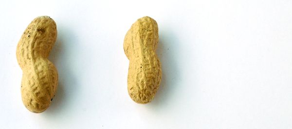
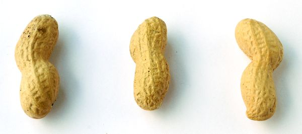
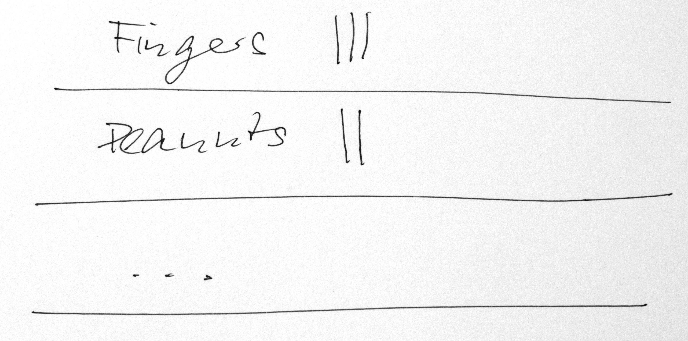
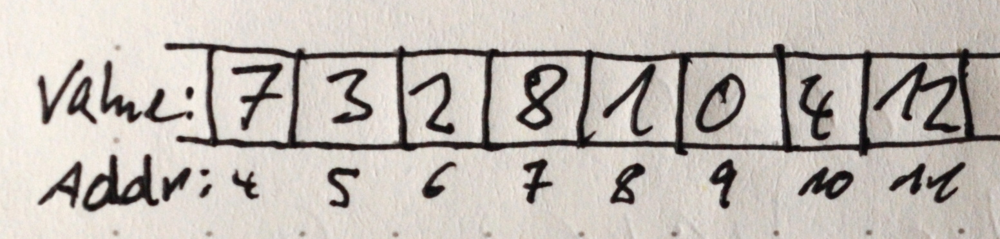
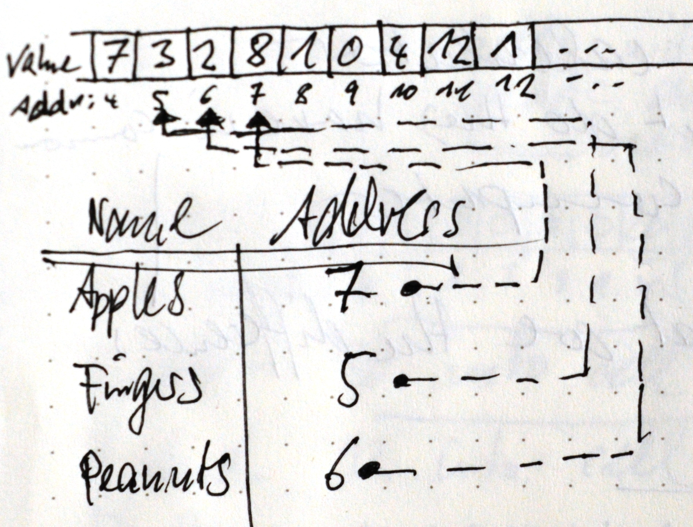
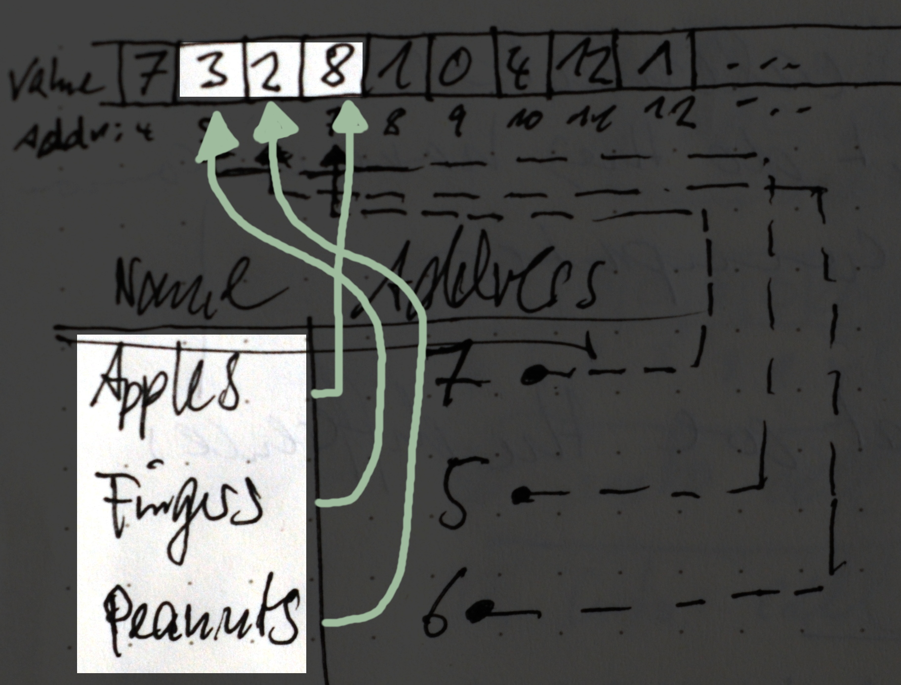
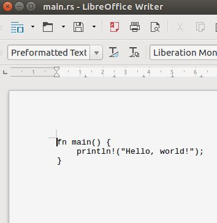
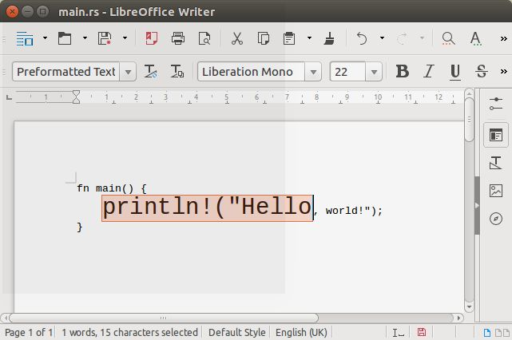
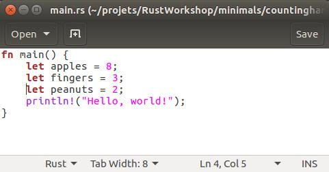

**IMPORTANT: ** Do not work on the content in this file directly. Work on the respective branches and then merge into master, creating this compilation of all examples.

This is work in progress!! Most of the sections are still missing !!!


Minimal Instructives
====================


A collection of small but dense examples will dare the learner to get in touch with the complexities of systems programming in rust.

Nevertheless it strives for beeing an intro from scratch, with no prior programming skills required. Happy to receive your feedback.


Intro: Rust for absolute beginners
----------------------------------

Computers are complex machinery.
* Making a microchip out of a piece of silicium to do calculations is not trivial.
* Even an outdated smartphone is by (several) orders of magnitude more complex
    than the computer used in the [Apollo Guidance Computer (Wikipedia)](https://en.wikipedia.org/wiki/Apollo_Guidance_Computer).

Programming languages are tools to handle part of the complexities of the machinery.

* Programming languages differ regarding the amount of complexity they show or hide from their users. How much you want/need to see depends on what you want to learn/do.

* If you are interested in how things really work, this course may be _the right choice_ for you.

* If you prefer quick results over a deeper understanding of the machines you are working on, I do not recommend this course to you. I.e. if you are striving for web development there is no need for the level of control rust is offering you. In that case you can save a lot of time in mastering the (beautiful) complexities that come in tow with the core design of rust as a language.

    * For instance, [Python](https://www.python.org/), [Ruby](https://www.ruby-lang.org/), [Java][1java], [Java Script](https://en.wikipedia.org/wiki/JavaScript) offer much more background functionality to make contemporary information processing machinery convenient to use.
    * You see less of the complexity . . .
    * . . . and you have to learn less about it.

[1java]: https://en.wikipedia.org/wiki/Java_(programming_language)

* Rust, was designed as a systems programming language.
    * Its purpose is not to hide the compexity away from its users but to expose it to them.
    * It will bring you in contact with the priciples of computing machinery: Your PC, tablet,  mobile phone, more specific microcontrolers . . .


### Information Processing Technology





Whether it is fingers, peanuts or strokes on paper -- or electrical signals in a wire or microchip. The underlying idea is the same.
one, two, three.

Why is calculating with hands or with calculator so much simpler than making a modern computer calculate? A person who uses hands, or paper to calculate is, in fact not only using hands or paper, but also a brain that knows how to calculate.

Programming means to transform the knowledge of person into a sequence of instructions suitable for a stupid piece of silicium to execute them. That is why calculating is relatively simple, but making a calculator is not.

[]()


### Memory

How much did we have of apples, peanuts, fingers,  . . ?



Today's computers have a memory that is organised in cells with addresses. Technically, there is no such thing as names for rows in a table as in the picture above. Just memory _cells_ with _addresses_. You can think of it as numbered locations of equal size.



For the machine there is only addresses, numbers of cells, in consecutive order. In each cell, there is a value. There is no such thin as an empty cell. There is always a number in each cell so we must be careful, which cells to use.

> Ok, `fingers` at address 5, `apples` at address 7, `peanuts` at address 6, . . .

To make it easier (for humans) to keep track of which value is kept at what address, we use variables. At first it looks more complicated:



As a human, you can relax and focus on two parts only: variables' names and their values.




#### Variables in Rust

As I mentioned above, programming languages were designed to mediate between the technical complexities and the way humans prefer to think. Variables are the first feature we will learn in this respect.

In rust you can express the situation like this
```
let apples = 8;
let fingers = 3;
let peanuts = 2;
```

The _Counting Hands_ project in the next larger section will guide you into rust so that you can try it yourself.


### Operations


Memory stores the data we want to process. Operations are the steps that actually process the data.

**Count one up:**

 &rarr;


 &rarr;


**Count one down:**

 &rarr;


 &rarr;


If you combine them carefully you can do proper calculations:

**Add hands:**

Yes, I should say add the value of one hand to the value in another.


+


How do we do it? Here is a simple _program_ for adding two numbers with hands and fingers:

As long as we see a finger in the right hand we:
* `count one down` on the right hand and
* `count one up` on the left hand

And this is how it executes for 1 + 2:

1. **Left:**   **Right:** 

2. **Left:**   **Right:** 

3. **Left:**   **Right:** Yes, I should have taken a picture of a hand showing zero fingers.

4. You are getting the point. Now that the right hand does not show any fingers we do not continue and in the right hand have our
**Result!!**

#### Operations in Rust
In rust, you would express this as follows

```
let mut left_hand = 1;
let mut right_hand = 2;

while right_hand > 0 {
    left_hand = count_one_up(left_hand);
    right_hand = count_one_down(right_hand);
}
```

At this point, we can not yet test this example in rust. But we will come back to it after finishing some essential preparations.


First Project: Counting Hands
-----------------------------

### Step1: Your first project

First, you have to open a console window. The console works like a chat window, except that you chat with your _operatin system_ and the things you type in are _commands_ which it would (try to) execute.

TODO: add/link to instructions how to open a console and walk to the directory where the project will be created (also in mac and windows); What is a working directory . . . etc.

Now, you should have a console window open and your working directory/folder should be the place where you want to place the project.

Typically, the console window reminds you of the directory you are in at the moment, here `~/projets/RustWorkshop/minimals` and the `$` indicates that it is waiting for a command to be typed.  Your console should show something like

```
[~/projets/RustWorkshop/minimals]$

```

Make a new project by typing `cargo new --bin countinghands` into the console. Instead of `countinghands` you can choose whatever name you like.

Not much seems to have happened, except for a new line is shown, again with the working directory reminder and the `$`.

```
[~/projets/RustWorkshop/minimals]$ cargo new --bin countinghands
[~/projets/RustWorkshop/minimals]$

```
Don't worry, not news is good news in this case, cargo does not reply anything if everything goes as expected. You can check about the new project by typing `ls`:
```
[~/projets/RustWorkshop/minimals]$ ls
countinghands  graphout  README.md
```
What you will see exactly, will depend on the contents of your directory but you should find the name of your new project among the reply of `ls`.

By typing `cd countinghands` (or whatever name you gave it) you change your working directory so that it is now the project directory.

The following snapshot shows you what cargo will create for you in a subdirectory named `countinghands`.

#### [Testing] Step 1
Type `cargo build` into the console which should now look something like this:
```
[~/projets/RustWorkshop/minimals/countinghands]$ cargo build
   Compiling countinghands v0.1.0 (file:///home/broe/projets/RustWorkshop/minimals/countinghands)
    Finished debug [unoptimized + debuginfo] target(s) in 0.55 secs
[~/projets/RustWorkshop/minimals/countinghands]$
```
Type `cargo run` and you should see
```
[~/projets/RustWorkshop/minimals/countinghands]$ cargo run
    Finished debug [unoptimized + debuginfo] target(s) in 0.0 secs
     Running `target/debug/countinghands`
Hello, world!
[~/projets/RustWorkshop/minimals/countinghands]$
```

Cargo has _built_ the first project into something that your _operating system_ can lounch as an application or 'app'. Traditionally, the minimal app to begin with is one that just sais `Hello world!`. In our case, cargo has already created that for us and you should see `Hello world!` in your console now.


#### [Snapshot] Step 1
Whenever a useful intermediate state is achieved, a _snapshot_ will offer the project (as it should be at this point) for download. Furthermore, you can investigate the changes that were made from the last project.


[download files](https://github.com/broesamle/RustWorkshop/releases/tag/countinghands01_firstproject)
|
[see changes](https://github.com/broesamle/RustWorkshop/commit/f46e703d85ea21bf90d1d59c58fa511d5daa7ee8)


### Step 2: Where is 'the program'?

Now that we have already used the `cargo` _build system_ for to create your first app the next obvious question is: Where is 'the program'. There is three important components involved:
* The _source code_ is what humans can read and write. Here, this is written in _Rust_.
* The _build system_ translates the source code into something that . . .
* . . . your operating system can start as an _application_ or _executable_.

The sources are located in the subdirectory `src` in your project folder. Lets have a look: `ls src/` should show you that the file `main.rs` is there.

```
[~/projets/RustWorkshop/minimals/countinghands/src]$ ls src/
main.rs
[~/projets/RustWorkshop/minimals/countinghands/src]
```

`cat src/main.rs` finally shows you 'the program', the source of the program, to be precise:
```
fn main() {
    println!("Hello, world!");
}
```

=======


### Step 3: Your first lines of source code

In the former step you have seen the _listing_ of the source code (in file `main.rs`). In order to make changes to the source code you need to use a _text editor_. This is different to a word processor. It edits only the characters but does not allow to introduce any formatting, like **bold** or _italics_ and the like.

Open `main.rs` in your favourite text editor which you should have installed on your system before.

TODO: Link to the tut for setting up the machine tutorial

If you are unsure what to use you can -- for now -- try some of the following commands:


```
geany src/main.rs &

atom src/main.rs &

gedit src/main.rs &

kate src/main.rs &

nano src/main.rs &

pico src/main.rs &

. . .
```
According to the primary addressees of this comment I have chosen those candidates which loosely resemble the behaviour of a word processor.

> I should remark, though, that the question _What editor to use_ is among the topics discussed most emotionally in the community ;-)

----

#### &#9736; Pitfall

If you see your code nicely arranged on a _page_:



And you can change the format of some part of the overall code like this



then it is not a text editor but a word processor. If you save the file from there it will put all sorts of things in it but it will no longer be something the _rust built system_ would understand.

#### &#9728; Pitfall avoided!

----

If all goes well you should see the source code as an opened document in some editor. Nowadays editors often increase legibility by colouring different parts of the code differently; further evidence that you picked a programmers tool rather than an office document solution.

Returning to the section on variables you will find the three lines of rust code, each line for one variable:
```
let apples = 8;
let fingers = 3;
let peanuts = 2;
```
Insert them into the open file after the first line, which should then look something like this:



Save the file to disk (keeping the original name).

#### [Testing] Step 3

If you return to the console using `cat` again,  you can check if the saving was successful:

```
[~/projets/RustWorkshop/minimals/countinghands]$ cat src/main.rs
fn main() {
    let apples = 8;
    let fingers = 3;
    let peanuts = 2;
    println!("Hello, world!");
}
[~/projets/RustWorkshop/minimals/countinghands]$
```

You should see the three inserted lines in the listing. Now you know they are in the (updated) source file let's give it a try and see what the rust build system says: `cargo build`

```
[~/projets/RustWorkshop/minimals/countinghands]$ cargo build
Compiling countinghands v0.1.0 (file:///home/broe/projets/RustWorkshop/minimals/countinghands)
src/main.rs:2:9: 2:15 warning: unused variable: `apples`, #[warn(unused_variables)] on by default
src/main.rs:2     let apples = 8;
                      ^~~~~~
src/main.rs:3:9: 3:16 warning: unused variable: `fingers`, #[warn(unused_variables)] on by default
src/main.rs:3     let fingers = 3;
                      ^~~~~~~
src/main.rs:4:9: 4:16 warning: unused variable: `peanuts`, #[warn(unused_variables)] on by default
src/main.rs:4     let peanuts = 2;
                      ^~~~~~~
```

Whow, that looks complicated ... as a professional, we quickly scan whether it is _errors_ or 'just' _warnigs_. We are happy because we only got warnings. (Don't be too lazy by ignoring them completely; they are a useful thing in most of the cases.)

What do they say? This is the line to look at first:
```
src/main.rs:2:9: 2:15 warning: unused variable: `apples`
```
* `unused variable` tells us that we created a variable whithout making use of it (this will be the next step!) in this case the warning apears three times, once for each variable `apples`, `fingers`, `peanuts`.

* `src/main.rs:2:9: 2:15` tells us the source file `src/main.rs`: the code line `2`: the column `9` where the 'problematic' bit starts; similarly where it ends.

* fortunately the added lines visualise the location again:
```
src/main.rs:2     let apples = 8;
                      ^~~~~~
```

`cargo run` will not make much difference (we were already warned about the useless-ness of these three lines of code.
```
    Finished debug [unoptimized + debuginfo] target(s) in 0.0 secs
     Running `target/debug/countinghands`
Hello, world!
```

### Step 4: Print the values of the variables

Just insert these two lines right after `println!("Hello, world!");`:

```
println!("There are {} apples, we see {} fingers and how many peanuts? {}, exactly.",
    apples, fingers, peanuts);
```

#### [Snapshot] Step 4
[inspect the source](https://github.com/broesamle/RustWorkshop/blob/76b438d255e60800c108a129fd646ebada7e2222/minimals/countinghands/src/main.rs)
|
[see changes](https://github.com/broesamle/RustWorkshop/commit/76b438d255e60800c108a129fd646ebada7e2222)
|
[raw source **main.rs**](https://github.com/broesamle/RustWorkshop/raw/76b438d255e60800c108a129fd646ebada7e2222/minimals/countinghands/src/main.rs)


#### [Testing] Step 4
You have to save the file and build the project, just as before.
Nice, the warnings about the unused variables are gone!

Now, run the project.

Your console should now look like this:

```
[~/projets/RustWorkshop/minimals/countinghands]$ cargo build
   Compiling countinghands v0.1.0 (file:///home/broe/projets/RustWorkshop/minimals/countinghands)
    Finished debug [unoptimized + debuginfo] target(s) in 0.37 secs
[~/projets/RustWorkshop/minimals/countinghands]$ cargo run
    Finished debug [unoptimized + debuginfo] target(s) in 0.0 secs
     Running `target/debug/countinghands`
Hello, world!
There are 8 apples, we see 3 fingers and how many peanuts? 2, exactly.
[~/projets/RustWorkshop/minimals/countinghands]$
```

#### [Explanation] Step 4

TODO insert explanation for formatted output!


### Step 5: Change the values of variables

Now that we can print the values on the console we can play around with changing the values of the variables.

**To the Mathematicians:** Variables are aliases to memory cells and they can be changed in the course of program execution. They are not like variables in a mathematical equations, where they are _placeholders_ to express something specific (yet to be found or to be defined).

We remove the line with the `Hello, world!` message and add two more lines behind the remaining `println! ...`:

* assign a new value to `apples`
* print all the values again.

```rust
apples = 12;
println!("Now, there are {} apples, we see {} fingers and how many peanuts? {}, exactly.",
    apples, fingers, peanuts);
```

**TODO:** Snapshot for Step 5a `countinghands05a_assig-to-immutable`


#### [Testing] Step 5a
This time we got an error, and it is a rust-typical one.
```
[~/projets/RustWorkshop/minimals/countinghands]$ cargo build
   Compiling countinghands v0.1.0 (file:///home/broe/projets/RustWorkshop/minimals/countinghands)
src/main.rs:8:5: 8:16 error: re-assignment of immutable variable `apples` [E0384]
src/main.rs:8     apples = 12;
                  ^~~~~~~~~~~
src/main.rs:8:5: 8:16 help: run `rustc --explain E0384` to see a detailed explanation
src/main.rs:2:9: 2:15 note: prior assignment occurs here
src/main.rs:2     let apples = 8;
                      ^~~~~~
error: aborting due to previous error
error: Could not compile `countinghands`.

To learn more, run the command again with --verbose.
```

Where to look? It works like with the warning discussed above:
```
src/main.rs:8:5: 8:16 error: re-assignment of immutable variable `apples` [E0384]
```

Rust _prevents_ us from changing the value of a variable unless we declare it to be mutable, `mut`:
```rust
let mut apples = 8;
```

**TODO:** Snapshot for Step 5b `countinghands05b_assig-to-mutable`

#### [Testing] Step 5b
```
[~/projets/RustWorkshop/minimals/countinghands]$ cargo build
   Compiling countinghands v0.1.0 (file:///home/broe/projets/RustWorkshop/minimals/countinghands)
    Finished debug [unoptimized + debuginfo] target(s) in 0.32 secs
[~/projets/RustWorkshop/minimals/countinghands]$ cargo run
    Finished debug [unoptimized + debuginfo] target(s) in 0.0 secs
     Running `target/debug/countinghands`
There are 8 apples, we see 3 fingers and how many peanuts? 2, exactly.
Now, there are 12 apples, we see 3 fingers and how many peanuts? 2, exactly.
[~/projets/RustWorkshop/minimals/countinghands]$
```

#### [Explanation] Step 5
We have worked on a _program_. The _source code_ in this case in the file `main.rs` describes (from top to bottom) all the steps that should happen when executing the programm (starting the application).

1. Declare variable `apples` as mutable.
2. Declare variable `fingers`.
3. Declare variable `peanuts`.
4. Output all three values to the console
    * where `{}` marks the positions in the _format string_ `"There are {} appl. . .`
    * at which to substitute the values of the variables
    * given after the format string (in the next line).
    * (This explanation of step 4 is certainly more precise than it needs to be at this point.)
5. The value of the memory cell, alias `apples` is changed from `8` to `18`.
6. Output the values again, with a slightly altered message.


### Step Using Operations

From an information processing POV, whenever something accesses or manipulates data we can say that it is an _operation_.

* Assigning a value to a _location in memory_/_a variable_ is an operation. (See previous step).

* Increasing or decreasing a value is an operation

* Comparing two values is an operation. It does not change any values in memory but the result of the comparison can influence the subsequent course of program execution.

Rust already 'knows' a lot of operations.


####

#### Step 6a: Increase a variable by one.

print the result of the increase

#### Step 6_: Add two variables and print the result

print the result of the increase


### Step 7: Finalise the Counting Hands

#### Step 7a: Try the program as outlined in _Operations_ section (it will not compile of course)

#### Step 7b: Define your own operations

```
fn count_one_up(hand) {
    hand + 1
}
```

#### Step 7c: Use your operations


Project: Graphics in a Window
-----------------------------

* Operating System
* compiler
* Library
* Standard Library

TODO: Is it responsible not to introduce closures up to this point?


### Step 1: New Project

TODO: we need a link to the intro/fundament example here.


#### [Snapshot] Step 1
[download files](https://github.com/broesamle/RustWorkshop/releases/tag/graphout01_new-project)
|
[see changes](https://github.com/broesamle/RustWorkshop/commit/c7dd93813e05d4142ad64fa903013cfa22331f30)

#### [Testing] Step 1
TODO: we need a link to the intro/fundament example here.


### Step 2: Access the Windowmanagement (and Graphics Output)

The _operating system_ offers functionality for opening a window. In order to use this, we need to `use` a number of _libraries_

```
use glutin_window::GlutinWindow as Window;
use piston::window::WindowSettings;
```

In other examples it was enough to `use std::sync` and then the program could be compiled. In this case the situation is a little different. We get an *ERROR*:

```
error: unresolved import `glutin_window::GlutinWindow`. Maybe a missing `extern crate glutin_window`? [E0432]
src/main.rs:1 use glutin_window::GlutinWindow as Window;
                  ^~~~~~~~~~~~~~~~~~~~~~~~~~~~~~~~~~~~~
```

The reason why the build system is not happy this time is because `glutin_window` it is not part of the rust _standard library. Refer to the extern crates like this:
```
extern crate piston;
extern crate glutin_window;
```

There is another error we have to address:

```
error: can't find crate for `piston` [E0463]
```

We refer to an _extern_ crate, integrate it into our program by its name `piston` and `glutin_window`. Since the crates in question are not part of the standard library, cargo will have to download them. What it wants to know now is which version it should get (and from which source etc).

Add the following to the `[dependencies]` section in `Cargo.toml`:

```
piston = "0.24.0"
pistoncore-glutin_window = "0.28.0"
```

Instead of `println!("Hello, world!");` we can now create a new window like this:

```
fn main() {
    let window: Window =
        WindowSettings::new("Hello World!", [512; 2])
            .build().unwrap();
}
```

#### [Snapshot] Step 2
[download files](https://github.com/broesamle/RustWorkshop/releases/tag/graphout02_open-window)
|
[see changes](https://github.com/broesamle/RustWorkshop/commit/3495e498198651826cb58e27c0fcdeb7d9f15064)

#### [Testing] Step 2

`cargo build` should output something like

```
Compiling graphout v0.1.0 (file:///home/broe/projets/RustWorkshop/minimals/graphout)
src/main.rs:8:9: 8:15 warning: unused variable: `window`, #[warn(unused_variables)] on by default
src/main.rs:8     let window: Window =
                   ^~~~~~
 Finished debug [unoptimized + debuginfo] target(s) in 1.50 secs
```

Don't worry about the `unused variable` warning for now.

Running the program `cargo run` gives the console output

```
    Finished debug [unoptimized + debuginfo] target(s) in 0.0 secs
     Running `target/debug/graphout`
```

Otherwise not much is happening. The careful observer (using a not too fast machine) may recognise a quick flash of a window or icon in the application louncher bar. So there is some interaction going on between our program and the operating system.

Despite not useful in itself, having those two components 'talk to each other' at all is a good result for now.


### Step 3: Event loop

The window 'just flashes' because our application quits immediately after lounching it. It follows the Scheme
* start
* run (from first to last instruction)
* terminate.

What we want is something like
* start
* run
* terminate, when the user 'closes the application'.

That is, the application reacts to event(s) which are generated outside the application: The user closes the window, presses `escape`, etc. First progress  towards reacting to events would be not to terminate (at all).

After creating the window we just loop infinitely (just add this line before the final `}`:

```
loop { }
```

#### [Snapshot] Step 3a
[download files](https://github.com/broesamle/RustWorkshop/releases/tag/graphout03a_infinite-loop)
|
[see changes](https://github.com/broesamle/RustWorkshop/commit/5cc87606651ac43ad0aeb7c00e30ed48fba96be7)

#### [Testing] Step 3a

It does the job, the window remains visible, containing weird mixture of background and titlebar... well, after all, we have created and 'registered' a window at the window management system of the _operating system_ but our application does not care about anything. It just loops infinitely.


Next, we need access to the events generated by the operating system's window management. In particular, it will provide a set of informations the _graphics library_ would need to 'draw things correctly'; window position, size etc.

One more dependency: `piston2d-opengl_graphics = "0.31.0"`.

Providing us an `extern crate opengl_graphics;` so that we can `use opengl_graphics::{GlGraphics, OpenGL};`.
Finally, we initialise the graphics system which we can now use.

```
let opengl = OpenGL::V3_2;
let gl = GlGraphics::new(opengl);
```

#### [Snapshot] Step 3b
[download files](https://github.com/broesamle/RustWorkshop/releases/tag/graphout03b_opengl_graphics)
|
[see changes](https://github.com/broesamle/RustWorkshop/commit/a74eabff42f439c633323ea22f4f1f82a00c07e2)

#### [Testing] Step 3b

`cargo build` should give:

```
   Compiling graphout v0.1.0 (file:///home/broe/projets/RustWorkshop/minimals/graphout)
src/main.rs:10:9: 10:15 warning: unused variable: `window`, #[warn(unused_variables)] on by default
src/main.rs:10     let window: Window =
                       ^~~~~~
src/main.rs:15:9: 15:11 warning: unused variable: `gl`, #[warn(unused_variables)] on by default
src/main.rs:15     let gl = GlGraphics::new(opengl);
                       ^~
    Finished debug [unoptimized + debuginfo] target(s) in 1.60 secs
```
No missing dependencies, all extern crates are there.
Complaints about unused variables are fine, we will use them in a minute.

Now, we replace the 'non-reactive' infinite loop with something that has the potential to react to events happening to the window, the keyboard and so on.

We will need:
```
use piston::event_loop::Events;
use piston::input::RenderEvent;
```

`window` and `gl` need to be mutable. We also will need to declare

```
let mut events = window.events();
```

The great change is to replace `loop {}` with an (admittedly not exactly trivial) construct that will also loop infinitely:

```
for e in events.next(&mut window) {
    if let Some(r) = e.render_args() {
        gl.draw(r.viewport(), |c, gl| {
            // all  drawing actions will happen here soon
        });
    }
}
```

* In every loop cycle it provides an event `e`.

* If the `e` has some render arguments attached to it `if let Some(r) = e.render_args()` . . .
* . . . we activate the graphics system via `gl.draw(...)`
* which gets additional information about how and where to draw based on `r.viewport()`

#### [Snapshot] Step 3c
[download files](https://github.com/broesamle/RustWorkshop/releases/tag/graphout03c_eventloop%2Bwindow)
|
[see changes](https://github.com/broesamle/RustWorkshop/commit/0f66156843c0732821572b34ff1bf453f4d303ed)

#### [Testing] Step 3c
The main difference is that now, we can close the window by pressing the close button `(x)` in the title bar. Again, this is not spectacular in itself but it indicates progress towards a smooth integration with the window system.
