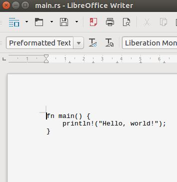
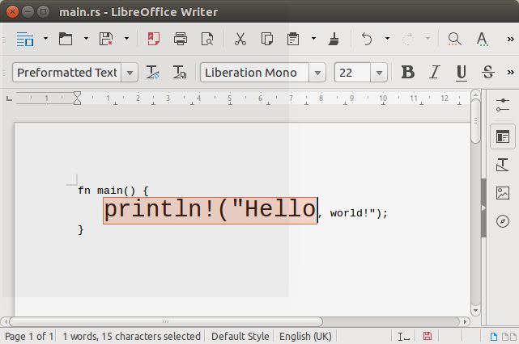

First Project: Counting Hands
=============================

### Step1: Your first project

First, you have to open a console window. The console works like a chat window, except that you chat with your _operatin system_ and the things you type in are _commands_ which it would (try to) execute.

TODO: add/link to instructions how to open a console and walk to the directory where the project will be created (also in mac and windows); What is a working directory . . . etc.

Now, you should have a console window open and your working directory/folder should be the place where you want to place the project.

Typically, the console window reminds you of the directory you are in at the moment, here `~/projets/RustWorkshop/minimals` and the `$` indicates that it is waiting for a command to be typed.  Your console should show something like

```
[~/projets/RustWorkshop/minimals]$

```

Make a new project by typing `cargo new --bin countinghands` into the console. Instead of `countinghands` you can choose whatever name you like.

Not much seems to have happened, except for a new line is shown, again with the working directory reminder and the `$`.

```
[~/projets/RustWorkshop/minimals]$ cargo new --bin countinghands
[~/projets/RustWorkshop/minimals]$

```
Don't worry, not news is good news in this case, cargo does not reply anything if everything goes as expected. You can check about the new project by typing `ls`:
```
[~/projets/RustWorkshop/minimals]$ ls
countinghands  graphout  README.md
```
What you will see exactly, will depend on the contents of your directory but you should find the name of your new project among the reply of `ls`.

By typing `cd countinghands` (or whatever name you gave it) you change your working directory so that it is now the project directory.

The following snapshot shows you what cargo will create for you in a subdirectory named `countinghands`.

#### [Testing] Step 1
Type `cargo build` into the console which should now look something like this:
```
[~/projets/RustWorkshop/minimals/countinghands]$ cargo build
   Compiling countinghands v0.1.0 (file:///home/broe/projets/RustWorkshop/minimals/countinghands)
    Finished debug [unoptimized + debuginfo] target(s) in 0.55 secs
[~/projets/RustWorkshop/minimals/countinghands]$
```
Type `cargo run` and you should see
```
[~/projets/RustWorkshop/minimals/countinghands]$ cargo run
    Finished debug [unoptimized + debuginfo] target(s) in 0.0 secs
     Running `target/debug/countinghands`
Hello, world!
[~/projets/RustWorkshop/minimals/countinghands]$
```

Cargo has _built_ the first project into something that your _operating system_ can lounch as an application or 'app'. Traditionally, the minimal app to begin with is one that just sais `Hello world!`. In our case, cargo has already created that for us and you should see `Hello world!` in your console now.


#### [Snapshot] Step 1
Whenever a useful intermediate state is achieved, a _snapshot_ will offer the project (as it should be at this point) for download. Furthermore, you can investigate the changes that were made from the last project.


[download files](https://github.com/broesamle/RustWorkshop/releases/tag/countinghands01_firstproject)
|
[see changes](https://github.com/broesamle/RustWorkshop/commit/f46e703d85ea21bf90d1d59c58fa511d5daa7ee8)


### Step 2: Where is 'the program'?

Now that we have already used the `cargo` _build system_ for to create your first app the next obvious question is: Where is 'the program'. There is three important components involved:
* The _source code_ is what humans can read and write. Here, this is written in _Rust_.
* The _build system_ translates the source code into something that . . .
* . . . your operating system can start as an _application_ or _executable_.

The sources are located in the subdirectory `src` in your project folder. Lets have a look: `ls src/` should show you that the file `main.rs` is there.

```
[~/projets/RustWorkshop/minimals/countinghands/src]$ ls src/
main.rs
[~/projets/RustWorkshop/minimals/countinghands/src]
```

`cat src/main.rs` finally shows you 'the program', the source of the program, to be precise:
```
fn main() {
    println!("Hello, world!");
}
```

### Step 3: Your first lines of source code

In the former step you have seen the _listing_ of the source code (in file `main.rs`). In order to make changes to the source code you need to use a _text editor_. This is different to a word processor. It edits only the characters but does not allow to introduce any formatting, like **bold** or _italics_ and the like.

Open `main.rs` in your favourite text editor which you should have installed on your system before.

TODO: Link to the tut for setting up the machine tutorial

If you are unsure what to use you can -- for now -- try some of the following commands:


```
geany src/main.rs &

atom src/main.rs &

gedit src/main.rs &

kate src/main.rs &

nano src/main.rs &

pico src/main.rs &

. . .
```
According to the primary addressees of this comment I have chosen those candidates which loosely resemble the behaviour of a word processor.

> I should remark, though, that the question _What editor to use_ is among the topics discussed most emotionally in the community ;-)

----

#### &#9736; Pitfall

If you see your code nicely arranged on a _page_:



And you can change the format of some part of the overall code like this



then it is not a text editor but a word processor. If you save the file from there it will put all sorts of things in it but it will no longer be something the _rust built system_ would understand.

#### &#9728; Pitfall avoided!

----

If all goes well you should see the source code as an opened document in some editor. Nowadays editors often increase legibility by colouring different parts of the code differently; further evidence that you picked a programmers tool rather than an office document solution.

Returning to the section on variables you will find the three lines of rust code, each line for one variable:
```
let apples = 8;
let fingers = 3;
let peanuts = 2;
```
Insert them into the open file after the first line, which should then look something like this:


Save the file to disk (keeping the original name).

#### [Testing] Step 3

If you return to the console using `cat` again,  you can check if the saving was successful:

```
[~/projets/RustWorkshop/minimals/countinghands]$ cat src/main.rs
fn main() {
    let apples = 8;
    let fingers = 3;
    let peanuts = 2;
    println!("Hello, world!");
}
[~/projets/RustWorkshop/minimals/countinghands]$
```

You should see the three inserted lines in the listing. Now you know they are in the (updated) source file let's give it a try and see what the rust build system says: `cargo build`

```
[~/projets/RustWorkshop/minimals/countinghands]$ cargo build
Compiling countinghands v0.1.0 (file:///home/broe/projets/RustWorkshop/minimals/countinghands)
src/main.rs:2:9: 2:15 warning: unused variable: `apples`, #[warn(unused_variables)] on by default
src/main.rs:2     let apples = 8;
                      ^~~~~~
src/main.rs:3:9: 3:16 warning: unused variable: `fingers`, #[warn(unused_variables)] on by default
src/main.rs:3     let fingers = 3;
                      ^~~~~~~
src/main.rs:4:9: 4:16 warning: unused variable: `peanuts`, #[warn(unused_variables)] on by default
src/main.rs:4     let peanuts = 2;
                      ^~~~~~~
```

Whow, that looks complicated ... as a professional, we quickly scan whether it is _errors_ or 'just' _warnigs_. We are happy because we only got warnings. (Don't be too lazy by ignoring them completely; they are a useful thing in most of the cases.)

What do they say? This is the line to look at first:
```
src/main.rs:2:9: 2:15 warning: unused variable: `apples`
```
* `unused variable` tells us that we created a variable whithout making use of it (this will be the next step!) in this case the warning apears three times, once for each variable `apples`, `fingers`, `peanuts`.

* `src/main.rs:2:9: 2:15` tells us the source file `src/main.rs`: the code line `2`: the column `9` where the 'problematic' bit starts; similarly where it ends.

* fortunately the added lines visualise the location again:
```
src/main.rs:2     let apples = 8;
                      ^~~~~~
```

`cargo run` will not make much difference (we were already warned about the useless-ness of these three lines of code.
```
    Finished debug [unoptimized + debuginfo] target(s) in 0.0 secs
     Running `target/debug/countinghands`
Hello, world!
```

### Step 4: Print the values of the variables

Just insert these two lines right after `println!("Hello, world!");`:

```
println!("There are {} apples, we see {} fingers and how many peanuts? {}, exactly.",
    apples, fingers, peanuts);
```

#### [Snapshot] Step 4
[inspect the source](https://github.com/broesamle/RustWorkshop/blob/76b438d255e60800c108a129fd646ebada7e2222/minimals/countinghands/src/main.rs)
|
[see changes](https://github.com/broesamle/RustWorkshop/commit/76b438d255e60800c108a129fd646ebada7e2222)
|
[raw source **main.rs**](https://github.com/broesamle/RustWorkshop/raw/76b438d255e60800c108a129fd646ebada7e2222/minimals/countinghands/src/main.rs)


#### [Testing] Step 4
You have to save the file and build the project, just as before.
Nice, the warnings about the unused variables are gone!

Now, run the project.

Your console should now look like this:

```
[~/projets/RustWorkshop/minimals/countinghands]$ cargo build
   Compiling countinghands v0.1.0 (file:///home/broe/projets/RustWorkshop/minimals/countinghands)
    Finished debug [unoptimized + debuginfo] target(s) in 0.37 secs
[~/projets/RustWorkshop/minimals/countinghands]$ cargo run
    Finished debug [unoptimized + debuginfo] target(s) in 0.0 secs
     Running `target/debug/countinghands`
Hello, world!
There are 8 apples, we see 3 fingers and how many peanuts? 2, exactly.
[~/projets/RustWorkshop/minimals/countinghands]$
```

#### [Explanation] Step 4

TODO insert explanation for formatted output!


### Step 5: Change the values of variables

Now that we can print the values on the console we can play around with changing the values of the variables.

**To the Mathematicians:** Variables are aliases to memory cells and they can be changed in the course of program execution. They are not like variables in a mathematical equations, where they are _placeholders_ to express something specific (yet to be found or to be defined).

We remove the line with the `Hello, world!` message and add two more lines behind the remaining `println! ...`:

* assign a new value to `apples`
* print all the values again.

```rust
apples = 12;
println!("Now, there are {} apples, we see {} fingers and how many peanuts? {}, exactly.",
    apples, fingers, peanuts);
```

**TODO:** Snapshot for Step 5a `countinghands05a_assig-to-immutable`


#### [Testing] Step 5a
This time we got an error, and it is a rust-typical one.
```
[~/projets/RustWorkshop/minimals/countinghands]$ cargo build
   Compiling countinghands v0.1.0 (file:///home/broe/projets/RustWorkshop/minimals/countinghands)
src/main.rs:8:5: 8:16 error: re-assignment of immutable variable `apples` [E0384]
src/main.rs:8     apples = 12;
                  ^~~~~~~~~~~
src/main.rs:8:5: 8:16 help: run `rustc --explain E0384` to see a detailed explanation
src/main.rs:2:9: 2:15 note: prior assignment occurs here
src/main.rs:2     let apples = 8;
                      ^~~~~~
error: aborting due to previous error
error: Could not compile `countinghands`.

To learn more, run the command again with --verbose.
```

Where to look? It works like with the warning discussed above:
```
src/main.rs:8:5: 8:16 error: re-assignment of immutable variable `apples` [E0384]
```

Rust _prevents_ us from changing the value of a variable unless we declare it to be mutable, `mut`:
```rust
let mut apples = 8;
```

**TODO:** Snapshot for Step 5b `countinghands05b_assig-to-mutable`

#### [Testing] Step 5b
```
[~/projets/RustWorkshop/minimals/countinghands]$ cargo build
   Compiling countinghands v0.1.0 (file:///home/broe/projets/RustWorkshop/minimals/countinghands)
    Finished debug [unoptimized + debuginfo] target(s) in 0.32 secs
[~/projets/RustWorkshop/minimals/countinghands]$ cargo run
    Finished debug [unoptimized + debuginfo] target(s) in 0.0 secs
     Running `target/debug/countinghands`
There are 8 apples, we see 3 fingers and how many peanuts? 2, exactly.
Now, there are 12 apples, we see 3 fingers and how many peanuts? 2, exactly.
[~/projets/RustWorkshop/minimals/countinghands]$
```

#### [Explanation] Step 5
We have worked on a _program_. The _source code_ in this case in the file `main.rs` describes (from top to bottom) all the steps that should happen when executing the programm (starting the application).

1. Declare variable `apples` as mutable.
2. Declare variable `fingers`.
3. Declare variable `peanuts`.
4. Output all three values to the console
    * where `{}` marks the positions in the _format string_ `"There are {} appl. . .`
    * at which to substitute the values of the variables
    * given after the format string (in the next line).
    * (This explanation of step 4 is certainly more precise than it needs to be at this point.)
5. The value of the memory cell, alias `apples` is changed from `8` to `18`.
6. Output the values again, with a slightly altered message.


### Step Using Operations

From an information processing POV, whenever something accesses or manipulates data we can say that it is an _operation_.

* Assigning a value to a _location in memory_/_a variable_ is an operation. (See previous step).

* Increasing or decreasing a value is an operation

* Comparing two values is an operation. It does not change any values in memory but the result of the comparison can influence the subsequent course of program execution.

Rust already 'knows' a lot of operations.


####

#### Step 6a: Increase a variable by one.

print the result of the increase

#### Step 6_: Add two variables and print the result

print the result of the increase


### Step 7: Finalise the Counting Hands

#### Step 7a: Try the program as outlined in _Operations_ section (it will not compile of course)

#### Step 7b: Define your own operations

```
fn count_one_up(hand) {
    hand + 1
}
```

#### Step 7c: Use your operations


[NEXT: Graphics Output](graphout.md)
